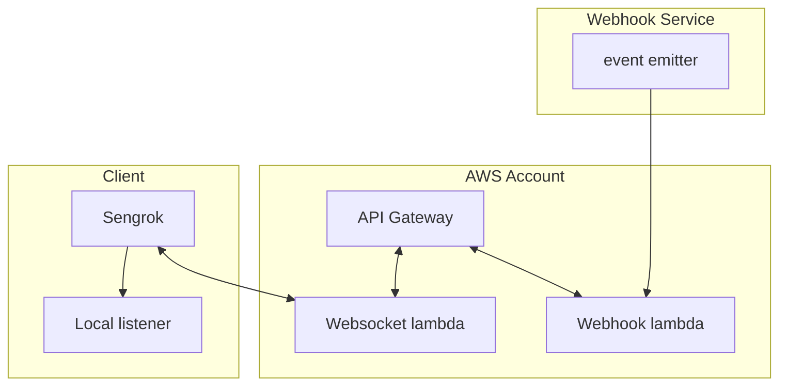

## Sengrok - serverless self-hosted ngrok-like service

### Why?

Testing webhook integrations is a tedious process. We'd better use CI for that.  
Guess what? `ngrok` and [friends](https://github.com/anderspitman/awesome-tunneling) do not really work in CI environments.  
Mainly because these tools produce a random url each time you run them.  
And the majority of public webhooks cannot be programmatically configured with a new url each time you launch a CI test.  

### How?

`sengrok` is a fully serverless solution, built on AWS.  
The architecture is pretty simple:


Webhook lambda listens for events from a public webhook.  
`sengrock` local executable connects to a websocket lambda
and issues `subscribe` command for some webhook route.  
Once subscribed it will receive all events from that webhook route 
and then forward it to your local listener of choice.

## To try

You will need a modern Node.js environment (18.x) and an AWS account credentials with sufficient permissions

```bash
git clone https://github.com/pkit/sengrok
yarn
yarn deploy
```

Output of deploy would look like:
```
Deploying sengrok to stage dev (us-east-2)
✔ serverless-better-credentials: credentials resolved from config ini profile: AWS_PROFILE (default)
Bundling with Webpack...
No external modules needed
Copying existing artifacts...

✔ Service deployed to stack sengrok-dev (35s)

endpoints:
  wss://xxxxx.execute-api.us-east-2.amazonaws.com/dev
  POST - https://yyyyyy.execute-api.us-east-2.amazonaws.com/{proxy+}
functions:
  webhookListener: sengrok-dev-webhookListener (860 kB)
  clientWebsocket: sengrok-dev-clientWebsocket (860 kB)
```
We are interested in the `wss://` url.

```bash
./sengrok forward wss://xxxxx.execute-api.us-east-2.amazonaws.com/dev /github http://localhost:3000
```
The command above will connect to the deployed service and forward all `/github` events to `http://localhost:3000`  

Now you can set up the webhook in actual GitHub using the second URL from above (and the route `/github`):
```
https://yyyyyy.execute-api.us-east-2.amazonaws.com/github
```

Configuring another webhook doesn't require deploying anything again.

Just add some other route to the webhook you're interested in:
```
https://yyyyyy.execute-api.us-east-2.amazonaws.com/another/webhook/route
```

And start another `sengrok` listener.  
That one will forward `/another/webhook` to `http://localhost:3001/events`
```bash
./sengrok forward wss://xxxxx.execute-api.us-east-2.amazonaws.com/dev /another/webhook/route http://localhost:3001/events
```

### FAQ

- __How to use another region?__  
By default, deploy script uses `us-east-2`.  
To select another region run: `yarn deploy --region us-west-2`


- __How to deploy multiple listeners to the same webhook?__  
Just run another `sengrok` with the same arguments.  
All events will be broadcast to all the subscribers.


- __How to un-deploy?__  
To un-deploy run: `yarn remove --region us-east-2`

